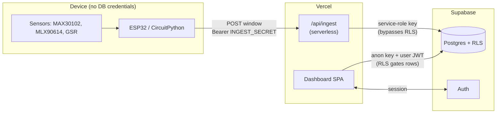
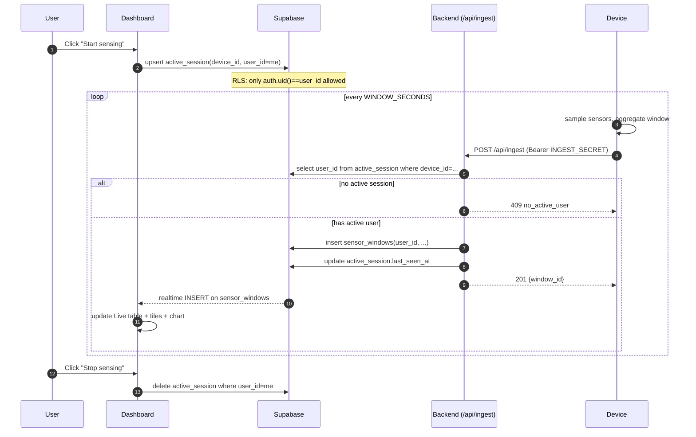

# ImmuneSense — Architecture

## Components

| Component | Tech | Where it runs | Holds secrets? |
|---|---|---|---|
| **Device** | ESP32 + CircuitPython | local hardware | shared `INGEST_SECRET` only |
| **Backend** | Vercel serverless (Node) | Vercel edge | `SUPABASE_SERVICE_ROLE_KEY`, `INGEST_DEVICE_SECRET` |
| **Database** | Supabase Postgres | Supabase | n/a |
| **Dashboard** | Vite SPA (React) | Vercel static | only the public `anon` key |

## Trust boundaries



Two important invariants:

1. **The device never has DB credentials.** Compromising the device leaks
   only the `INGEST_SECRET`, which lets an attacker spam window inserts but
   not read other users' data.
2. **The dashboard never has the service-role key.** Anything the dashboard
   can do is constrained by RLS using the user's JWT.

## Data flow — the "start sensing" lifecycle



## Data shapes

### `POST /api/ingest` request body

```json
{
  "device_id": "immune-feather-1",
  "window_seconds": 30,
  "heart_rate_bpm": 78.4,
  "hrv_ms": 42.1,
  "skin_temp_c": 36.7,
  "eda_microsiemens": 4.2,
  "quality_flag": 0
}
```

Headers: `Authorization: Bearer <INGEST_SECRET>`, `Content-Type: application/json`.

### Response

| Status | Body | Meaning |
|---|---|---|
| 201 | `{ window_id, user_id }` | Window written for the active user |
| 401 | `{ error: "unauthorized" }` | Bearer secret missing or wrong |
| 409 | `{ error: "no_active_user", device_id }` | Dashboard hasn't claimed the device — drop or buffer |
| 400 | `{ error: "device_id required" }` | Malformed body |
| 500 | `{ error, detail }` | DB failure |

### Tables touched

| Table | Written by | Read by |
|---|---|---|
| `auth.users` | Supabase Auth | Dashboard (session) |
| `profiles` | Dashboard (onboarding) | Dashboard (status header) |
| `active_session` | Dashboard (start/stop) | Backend (route ingest), Dashboard (status pill) |
| `sensor_windows` | Backend (ingest) | Dashboard (live + overview) |
| `inferences` | (future) ML worker | Dashboard (score + risk) |

## Why the active-session indirection?

The simpler design — "device knows the user_id and includes it in the
payload" — fails for three reasons:

1. The device would need to be re-flashed every time a new person uses it.
2. Anyone with `INGEST_SECRET` could log windows against any `user_id`.
3. There's no UI affordance for the user to *opt in* to being measured.

Putting `active_session` between the dashboard and the backend solves all
three: the user controls who the device is measuring with one click, the
device only authenticates itself (not a user), and there's a clear audit
trail of who claimed the device when.

## Failure modes and how they're handled

| Failure | Behavior |
|---|---|
| Device offline | Loop catches exception, sleeps 2 s, retries Wi-Fi/POST |
| Backend unreachable | Same — windows for that period are lost (not buffered to flash yet) |
| No active user when device POSTs | Backend returns 409, device logs "no active user", continues sampling |
| Dashboard goes offline mid-session | Realtime reconnects on focus; no data loss (writes go through backend) |
| Service-role key leaked | Rotate in Supabase Studio → all `inferences`/`sensor_windows` writes from old key fail |
| `INGEST_SECRET` leaked | Rotate Vercel env + device `settings.toml`; abuse is bounded to writing rows to whoever's currently active |

## Future work

- Move `inferences` from manual SQL inserts to a model-serving worker that
  consumes new `sensor_windows` rows (Supabase Edge Function or polling
  worker analogous to the legacy `supabase_to_edge.py`).
- Per-device secrets (`device_secrets` table, hashed) once we have >1 device.
- Local-flash buffering on the device for offline windows so we don't drop
  data on Wi-Fi blips.
- Calibration flow that writes the user's resting baseline into `baselines`
  during onboarding (UI exists for showing deviation; capture not wired up).
